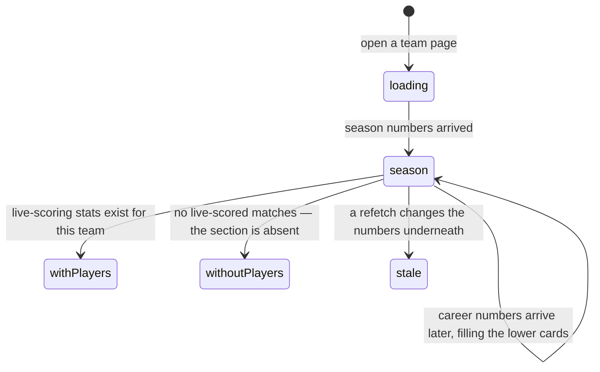

# Team and player statistics

## Summary

Almost every number 717rec shows about a team is derived, not stored. This
document is the map: what each number on a team's page means, where it comes
from, and which of them are season numbers, career numbers, or live-scoring
numbers.

There are three separate families and they behave differently. **Team season
numbers** come from the server and cover the active season. **Team career
numbers** are worked out in the browser across every season a team has played.
**Player numbers** exist only for matches that were scored live, round by round,
and are absent for every match reported as a final score.

Power score has its own document, [`power-score.md`](power-score.md). The
standings table is [`standings-and-rankings.md`](standings-and-rankings.md). The
page these numbers live on is
[`teams/team-details.md`](../teams/team-details.md), which owns its layout; this
document owns the numbers.

## The simple case

A player opens their team's page. At the top are two cards: a power score gauge
with their record under it, and their rank out of the league with a trend arrow.

Below that is the roster. Under the roster, if the team has played any live-scored
matches, is a "Player Stats" section — one card per player with PPR, DPR, a
three-colour bar showing where their bags landed, four-baggers, and games won and
lost.

Under that is a stat breakdown in two tabs, Core and Advanced, then a report
card of letter grades, then rivalries, head-to-head records, career totals, and a
career power score chart.

Every number is read-only. Nothing on the page can be changed by anyone,
including an admin.

## The interaction, event by event

### Arrive

The season numbers arrive first, as one row per team from the server. The career
numbers take longer: they are batched across every team in the league and cached
for ten minutes, so the lower half of the page fills in after the top.

Player statistics are fetched separately, per team and per season. **Nothing
appears at all** if there are none — no empty state, no "not tracked yet"
message. The section is simply absent, so a team that has never been scored live
looks exactly as it did before the feature existed.

**Nothing is written by arriving.**

### Leave without changing anything

Nothing is recorded and nothing is kept. Which sections were collapsed is
forgotten.

### Begin editing

Nothing here is editable. The controls are all view switches: a Core/Advanced tab
strip, a Season/Career toggle on the report card, collapse chevrons on most
sections, and links out to a team, a match, or the compare page.

### While editing

Switching the report card between Season and Career swaps every grade at once,
because the two modes are graded against different populations — this season's
teams, or every team that has ever played including hidden ones.

### Submit

Not applicable. There is no commit on any of these numbers.

## Team season numbers

| Number | What it is | Where it comes from |
| --- | --- | --- |
| **W-L** | Matches won and lost this season. | Counted on the server from completed matches. Every match counts, including ones whose opponent division could not be resolved. |
| **Win %** | Matches won divided by matches played. | Server. |
| **Games** | Games won and lost, summed across matches. | Server. |
| **Game %** | Games won divided by games played. | Server. |
| **SOS** | Strength of schedule: the average division weight of the opponents faced, held between 0.1 and 1.0, shown to three decimals. | Server. Not the average power score of opponents. |
| **Power score** | The rating. | Server. See [`power-score.md`](power-score.md). |
| **Rank** | Position in the whole league by power score. | Worked out in the browser from the sorted standings. |
| **Trend** | Movement since the last weekly snapshot. | Compared in the browser against a stored snapshot. Blank for a team that has never been ranked. |
| **Streak** | The current run of wins or losses, as `W3` or `L2`. | Worked out in the browser from the match list, newest first, stopping at the first result that breaks the run. Ties are skipped rather than breaking a streak. **Playoff matches count.** |
| **Close losses** | Matches lost in which the team still won at least one game — a 1–2 defeat. | Server. |
| **Sweeps and sweep rate** | Matches won 2–0, and that count as a percentage of *all* matches played — not of matches won. | Worked out in the browser from the team's match list. |
| **Clutch record** | Wins and losses in matches that went to a deciding third game, and the win rate in them. | Worked out in the browser from game wins summing to three. |

The browser-side numbers and the server-side numbers are built from different
sources, which is why they can briefly disagree after a result changes: the
server row and the match list are two separate fetches with two separate caches.

## Team career numbers

Career numbers cover every season a team has played and say so. They are computed
in the browser, batched across the league, and cached for ten minutes.

They include career matches and games won and lost, career win rates, career
playoff record, championships and runner-up finishes, career sweep rate, career
clutch win rate, career strength of schedule, and career power score.

Two things are worth knowing:

- **Hidden teams are included in career tables**, deliberately, even though they
  are excluded from the standings. A team that stopped playing keeps its career
  record.
- **Career numbers are also expressed as percentiles.** A team page can show
  where a team sits against every other team on win rate, game win rate, power
  score, strength of schedule, championships, and playoff win rate.

## The report card

The report card turns percentiles into letter grades, in six categories:

| Category | Graded on |
| --- | --- |
| Overall | Power score |
| Consistency | Win rate |
| Games | Game win rate |
| Offense | Sweep rate |
| Clutch | Game-3 win rate |
| Schedule | Strength of schedule |

Grades run A+ down to F, banded by percentile: A+ at 95, A at 90, down to D at
25 and F below it. A weighted GPA combines them, with Overall counting three
times and Consistency twice.

All six are ranked against the rest of the league, in both modes. A team's sweep
rate and game-3 record are counted from the league's match list, so a team is
compared with what its opponents actually did.

**Only teams that have a rating are in that comparison.** A team whose Power
column reads "—" has played nothing to measure — its win rate and game rate are
0 out of 0, and its strength of schedule is a filler value rather than a
schedule it faced. It is left out of all six comparisons, and it gets no report
card of its own: the card says "Not enough data to generate a report card yet.
Play some matches first!" So a new team neither collects six F grades it has not
earned nor makes every other team's grade look better than it is.

A team that has never played a deciding third game has no game-3 record to rank.
Its Clutch card shows a dash rather than a letter, and the GPA is worked out from
the other five — the missing grade neither helps nor hurts. This is the same rule
points per round follows in the player section.

## Player numbers

Player statistics come from rounds, which exist only for matches scored live. A
league that never uses live scoring gets full team statistics and no player
statistics at all.

| Number | What it is |
| --- | --- |
| **Rounds** | Rounds the player threw in this season. |
| **PPR** | Points per round: points scored while they were throwing, divided by rounds thrown. Shown to two decimals, or "–" when they have thrown none. |
| **DPR** | Differential per round: their points minus the opponents' points over the same rounds, divided by rounds. Green when positive, red when negative. |
| **Hole / Board / Off** | Where their bags landed, as three percentages of all bags thrown, drawn as one three-colour bar. Reads "Bag placement not tracked" when the detail was never entered. |
| **4B** | Four-baggers: rounds where every bag went in. |
| **Games** | Games won and lost in the games they played. |

Players are listed with the busiest first, by rounds thrown.

Bag detail is optional when a round is entered, so a team can have PPR and DPR
with no placement bar. See
[`live-scoring/enter-a-round.md`](../live-scoring/enter-a-round.md).

## Modifiers

| Modifier | Set at arrival | Changed while editing |
| --- | --- | --- |
| The user's role | No effect on the numbers. A visitor, a player, and an admin see identical statistics. A player on the team additionally sees the team's management controls, which change nothing here. | No effect. |
| The record's state | A team with no completed match shows a record of 0-0, "—" for power score, and "N/A" for streak. A team with no live-scored match has no player section. A team with no career history has an empty career table. | A result completing elsewhere changes the season numbers on the next refetch. Career numbers follow up to ten minutes later. |
| The season's state | Season numbers are the active season and never say so. Career numbers span every season and say so in their headings. Player statistics are the active season only. | A season activated elsewhere resets every season number to zero once the season cache expires. Career numbers absorb the old season instead. |
| Viewport | The stat breakdown is a two-tab card at every width. Player cards are one column on a phone and a grid on a wide screen. | No effect beyond re-flowing. |
| Keys the page honours | Nothing is focused on arrival. Tab reaches the tab strip, the collapse chevrons, and each link. | Left and right arrows move between the Core and Advanced tabs, as standard for a tab strip. |

## Cancel and interrupt

| Event | Before the first edit | While editing or submitting |
| --- | --- | --- |
| Escape, or a Cancel button | No effect. There is nothing to cancel. | No effect. |
| In-app navigation away, or switching tab within the page | Nothing is lost. | The tab choice, the report card mode, and which sections were collapsed are all forgotten. |
| Browser back or forward | Returns to the previous page. | Coming back re-opens the page in its default arrangement, with the numbers refetched. |
| Reload, or the tab closed | Reloads everything, season numbers first and career numbers second. | Same. |
| Network lost mid-request | The page shows its own failure state; the sections that had loaded stay. | Numbers already on screen stay on screen with nothing marking them stale. The player section, failing, simply does not appear — the same as having no data. |
| The request fails or times out | As above. Reads are retried once. | The player statistics query is retried once unless live scoring is switched off for the league, in which case it is not retried at all and the section stays absent. |
| The session expires | No effect. Every number here is public. | No effect. |
| The same record changed in another tab, or by another user | Not applicable before arriving. | **No realtime anywhere.** A result approved by an admin does not reach the page until a refetch. Season and career numbers refetch on different schedules, so for a while the two halves of the page describe different states. |
| Browser autofill or a password manager writes into the form | No effect. There are no fields here. | No effect. |
| The window loses focus | No effect. | Returning to the tab refetches the season numbers, so the top of the page can change while the bottom does not. |

## Interactions with other systems

**Permissions and roles.** None. Every number here is public and read-only. See
[`cross-cutting/permissions.md`](../cross-cutting/permissions.md).

**Season scoping.** Season numbers and player numbers are the active season.
Career numbers are not. Nothing on the page names the season except the badge at
the top of the standings. See
[`foundations/seasons.md`](../foundations/seasons.md).

**Validation and error display.** Nothing to validate. Missing numbers are shown
as "—", "N/A", or "–" depending on which component draws them, which is
inconsistent but never wrong.

**Unsaved changes.** None.

**Optimistic updates and rollback.** None.

**Realtime.** None.

**Offline.** Nothing loads and nothing is cached for offline reading.

**Toasts and notifications.** None from reading statistics.

**URL state.** Only the team. The tab, the report card mode, and the collapsed
sections are lost on navigation, so a particular view of a team's statistics
cannot be shared.

**On a phone.** Everything stacks into one column. The player cards keep their
placement bar at every width. See
[`cross-cutting/on-a-phone.md`](../cross-cutting/on-a-phone.md).

**Accessibility.** The bag placement bar carries a spoken description of all
three percentages, which is unusually good. Grades are colour-coded and also
spelled out as letters, so colour is not the only signal. The tab strip is a
standard one and works from the keyboard.

**Side effects the user can notice.** None from reading. Opening one team's page
loads and caches the whole league's career numbers, which is why the second team
page in a session fills in immediately.

## Edge cases

- **Sweep rate is a share of all matches, not of wins.** A team that wins half
  its matches and sweeps every one of them shows 50%, not 100%.
- **A grade with nothing to measure shows a dash.** Only Clutch can reach that
  state, and only for a team that has never played a game 3. A team with no
  rating at all gets no card rather than a card of dashes.
- **A failed load says so.** If the league's match list cannot be fetched, the
  report card and the GPA leaderboard both show a failure message with a Try
  Again button, not "not enough data" — which would blame the team for a
  problem with the request.
- **A player on two teams accumulates statistics under both.** Nothing in the
  product prevents it and nothing merges them.
- **A player who has never been recorded as throwing does not appear at all** in
  the player section, even though they are on the roster.
- **PPR is blank rather than 0.00** for a player with no rounds. The distinction
  is deliberate.
- **Bag placement can be missing while PPR is present**, because bag detail is
  optional per round.
- **The streak counts playoff matches**, so a team can finish a season on a
  losing streak having won its division.
- **Career numbers include hidden teams**, so a career table can name teams the
  standings do not show.
- **A team with no matches at all has a career power score of 0**, which places
  it last in the career table, below every team with a record.

## Open questions and verification

- **Missing values are rendered three different ways** — "—", "N/A", and "–" —
  depending on which component draws them.
- Not confirmed by hand: whether any team in the live database has live-scoring
  player statistics yet, and therefore whether the player section has ever
  appeared.
- Not confirmed by hand: how long the career batch takes on a league of this
  size, and whether the lower half of a team page visibly lags the top.
- Not confirmed by hand: what a player card looks like for someone with a
  handful of rounds, where PPR and DPR are very noisy.
- "Close losses" is defined on the server as **matches lost in which the team
  still won at least one game** — that is, lost 1–2. Nothing in the application
  code defines it, and nothing on screen explains it.

Verified against `717rec` commit `ea5c8f4`, except the report card grades, which
were changed after that commit, together with the handling of unrated teams and
of a failed load — see
[B-36](../bug-triage.md#b-36-two-grades-on-the-team-report-card-are-not-real-measurements).
