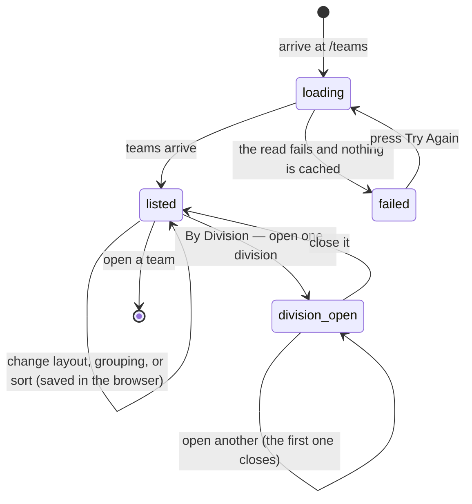

# Browse teams

## Summary

`/teams` is the league's directory. It lists every team playing this season, with
its record and its power score, and every entry is a way into that team's page.

It is the only page in the app with **display preferences that survive**: how the
teams are laid out, whether they are grouped by division, and how they are
sorted are remembered in the browser between visits. They are remembered per
browser, not per account, and they are never in the address, so the choice
cannot be shared or linked to.

It is also the page that **remembers where the user was scrolled to** and puts
them back when they come back with the browser's Back button.

## The simple case

The user opens `/teams`. A heading reads **TEAMS**, with the line "Browse all
teams or view by division" beside it on a wide screen. Under it are two pairs of
buttons: **Grid / List**, and **All Teams / By Division**.

Below that, a grid of small cards, one per team, sorted by power score. Each
card has the team's logo, its name, a division badge, its record, and its power
score. Clicking any of them opens that team's page.

The user opens a team, reads it, and presses Back. `/teams` returns with the
same layout, the same grouping, and the same scroll position.

## The interaction, event by event

### Arrive

Three preferences are read from the browser before anything is drawn:

| Preference | Choices | First-ever default |
| --- | --- | --- |
| Style | Grid, List | Grid |
| View | All Teams, By Division | **By Division** on a phone, **All Teams** on a wide screen |
| Sort | Rank, A-Z | Rank |

After the first visit the stored choice always wins, including the grouping —
so a user who chose "All Teams" on a wide screen keeps it if they later narrow
the window, and a phone that has been used once keeps whatever was chosen then.

Then the teams are fetched. **Hidden teams are removed**; see
[`foundations/league-objects.md`](../foundations/league-objects.md). Everything
else is listed, in every division, with no paging and no limit.

While the fetch is in flight the page shows three placeholder cards in the
chosen style. Nothing is focused and nothing is prefilled.

Arriving does write something, quietly: the three preferences are saved back to
the browser on the first render, whether or not the user touches anything.

### Leave without changing anything

The preferences are already saved. The scroll position is saved continuously
while the page is open, under the name of this route.

Nothing else is recorded, and no draft of anything is kept.

### Begin editing

There is nothing to edit here. "Editing" on this page means changing one of the
three preferences, and each takes effect immediately: the list fades out and
back in, re-sorted or re-grouped, and the choice is written to the browser at
once. There is no Apply and no Cancel.

**Sort is only reachable on a narrow screen.** On a phone the three preferences
are compact dropdowns reading `Sort: Rank · View: By Division · Style: Grid`. On
a wide screen only Style and View are drawn, so a desktop user cannot change the
sort at all and is left with whatever a phone last chose, or Rank. See
[Open questions](#open-questions-and-verification).

### While editing

**All Teams** draws one flat grid or list of every team.

**By Division** draws one collapsible section per division, each headed with the
division's name and the number of teams in it, and **only one can be open at a
time** — opening a second closes the first. Opening a section also scrolls it to
just below the top of the window, smoothly, which moves the page under the user.

One division starts open. Which one is not chosen: it is whichever non-empty
division happens to come first, which follows from the alphabetical order the
teams arrive in.

Sorting applies inside each division as well as across the whole list. Rank
sorts by power score, highest first, treating a team with no power score as
zero. A-Z sorts by name, ignoring case.

The address never changes. `/teams` is `/teams` in every combination.

### Submit

Nothing is submitted. This page only reads.

Two write actions exist on the cards and both are **admin only**: **Edit** and
**Delete**, in the "…" menu on each card. They belong to
[`admin/manage-teams-and-divisions.md`](../admin/manage-teams-and-divisions.md).
The menu itself is drawn for everyone; for a visitor or a player it contains one
item, **View Details**.

## Modifiers

| Modifier | Set at arrival | Changed while editing |
| --- | --- | --- |
| The user's role | Decides only what is inside each card's "…" menu. An admin gets Edit and Delete above View Details; everyone else gets View Details alone. The list itself is identical for all three roles. | Admin granted or revoked elsewhere reaches this page as soon as the profile reloads, and the menu items appear or disappear under the cursor. |
| The record's state | A hidden team is not listed at all. A team with no players, no matches, or no power score is listed like any other. | A team hidden elsewhere stays on screen until this page refetches. |
| The season's state | The list is not filtered by season; it is every team the league has, minus hidden ones. Records and power scores on the cards are the active season's. | A season changeover changes every record on the page at the next refetch, with no sign that it has happened. |
| Viewport | Decides the first-ever grouping default, the card layout, and whether Sort can be changed at all. On a phone a **grid** card shows only the logo, the name, and the record; the division badge, the power score, and the "…" menu are all dropped. A **list** card keeps everything, menu included. | Re-flows on rotation. The stored preferences do not change, so a window resized past the breakpoint keeps the grouping it had. |
| Keys the app honours | No shortcuts. Tab reaches the preference buttons, then each card's picture, name, and menu in turn. | Enter opens the focused link. Escape closes an open preference dropdown or card menu. |

## Cancel and interrupt

| Event | Before the first edit | While editing or submitting |
| --- | --- | --- |
| Escape, or a Cancel button | No effect. There is no Cancel on this page. | Closes an open dropdown or card menu. It does not undo a preference that has already been chosen — there is no undo. |
| In-app navigation away, or switching tab within the page | Preferences and scroll position are already saved. An open division is not: coming back opens the default one again. | Same. No request is ever in flight from this page except the initial read. |
| Browser back or forward | **Back into `/teams` restores the scroll position.** This is the only route in the app that does it. Forward into it does too, because both are history moves. | Same. |
| Reload, or the tab closed | Preferences survive; they are stored in the browser. Scroll position survives for the rest of the browser session. The open division does not. | Same. |
| Network lost mid-request | Nothing loads. In **By Division** the page shows "We couldn't load the teams. Please try again." with a Try Again button. In **All Teams** the same message appears only when nothing was cached; if a stale list is held, it is shown instead with no warning that it is old. | Preferences still save; they never touch the network. |
| The request fails or times out | The read is retried once, then one of the two states above. | As above. |
| The session expires | No effect. The list is public. | No effect. |
| The same record changed in another tab, or by another user | No realtime. A renamed team, a re-tiered team, or a newly hidden team does not reach an open page until a refetch. | Same. Two tabs can hold two different lists, and the preferences written by the last one to change win. |
| Browser autofill or a password manager writes into the form | No effect. There are no fields. | No effect. |
| The window loses focus | Nothing. | **Returning refetches the list if it is over five minutes old.** Records and power scores can change, and with Rank sorting the cards can re-order under the cursor. |

After an interrupt the user gets the page back with the layout and scroll they
left, and a list that may have moved on.

## Interactions with other systems

**Permissions and roles.** Reading needs nothing. Editing and deleting are
admin-only and hidden rather than disabled. See
[`cross-cutting/permissions.md`](../cross-cutting/permissions.md).

**Season scoping.** The teams are not season-scoped; the numbers on them are.
See [`foundations/seasons.md`](../foundations/seasons.md).

**Validation and error display.** No input, so no validation. Failures become an
in-page card with a Try Again button rather than a toast.

**Unsaved changes.** None exist. Every preference is saved the moment it is
chosen.

**Optimistic updates and rollback.** None on this page.

**Realtime.** None.

**Offline.** A list already fetched stays on screen and every team link still
navigates, because the team pages fetch their own data and will fail there
instead.

**Toasts and notifications.** None from browsing. Deleting a team raises one;
that belongs to the admin document.

**URL state.** None. The style, the grouping, the sort, and the open division
are all invisible to the address, so no arrangement of this page can be shared,
bookmarked, or reached by a link.

**On a phone.** Grid cards drop to two per row and carry only a logo, a name,
and a record, with no "…" menu — so an admin on a phone must switch to List
before they can edit or delete. Grouping defaults to By Division on a first
visit.

**Accessibility.** Each card's picture, name, and menu are separate links, so
every team is reached three times by Tab. The division headers are clickable
`div`s rather than buttons, and carry no expanded state, so a screen reader is
not told a section opened or closed. The smooth scroll on opening a division is
not offered as a preference.

**Side effects the user can notice.** Three preference values are written to the
browser on arrival even if nothing is touched. Nothing is sent to the league.

## Edge cases

- Resolved: **the empty state described filters that do not exist**, and its
  "View All Teams" button did a full browser load of the same address. Both fixed
  — see [B-30](../bug-triage.md#b-30-small-copy-and-labelling-slips). With no
  teams the page now reads "No Teams Found — There are no teams to show yet. An
  admin adds teams from the admin dashboard.", and there is no button.
- **In By Division mode an empty league reads differently**: "No teams available
  in any division."
- **A division that exists but has no teams is not drawn at all**, so the set of
  headings changes as teams move between divisions.
- **Opening a division scrolls the page.** On a short list this can scroll past
  the heading and the preference buttons.
- **Ranking by power score mixes divisions in All Teams mode.** There is no
  division ordering; a Recreational team can appear above a Competitive one.
- **A team with no power score reads "N/A" on a wide grid card** but sorts as
  zero.
- **Team links are built from the team's name**, not its id, so renaming a team
  changes its address and breaks any link or bookmark to the old one. Two teams
  whose names reduce to the same address would collide; see
  [`team-details.md`](team-details.md).
- **A hidden team is still delivered to the browser** and then removed before
  drawing. Hiding a team keeps it out of the list; it does not keep it secret.

## Open questions and verification

- **Sort can only be changed on a narrow screen.** A desktop user has no sort
  control at all, and is stuck with Rank unless the same browser was once used at
  phone width. **May be worth treating as a bug rather than documenting.**
- **The stored grouping ignores the screen it is used on after the first visit.**
  The phone-friendly default only applies when nothing has been stored, so the
  intended mobile default is lost as soon as a user changes anything anywhere.
  Worth a product decision rather than a fix.
- **The foundation says `/teams` is the only route with scroll restoration.**
  Three other routes call the same mechanism at this commit. This document does
  not claim to be the only one; the point needs settling in
  [`foundations/navigation.md`](../foundations/navigation.md) during the
  consistency pass.
- Not confirmed by hand: whether the scroll restoration actually lands correctly
  on a long list. It waits for the page to grow tall enough, retrying with
  increasing gaps for roughly fifteen seconds before giving up.
- Not confirmed by hand: which division opens first in practice, and whether it
  looks arbitrary to a user.
- Not confirmed by hand: what a very long team name does to a phone grid card,
  where names are truncated.
- The page's own test replaces the whole list with a stub, so everything above
  about layout, grouping, and sorting is read from the components rather than
  from a passing test.
- Assumption: the preferences are meant to be per browser rather than per
  account. Nothing stores them against a profile.

Verified against `717rec` commit `ea5c8f4`.
