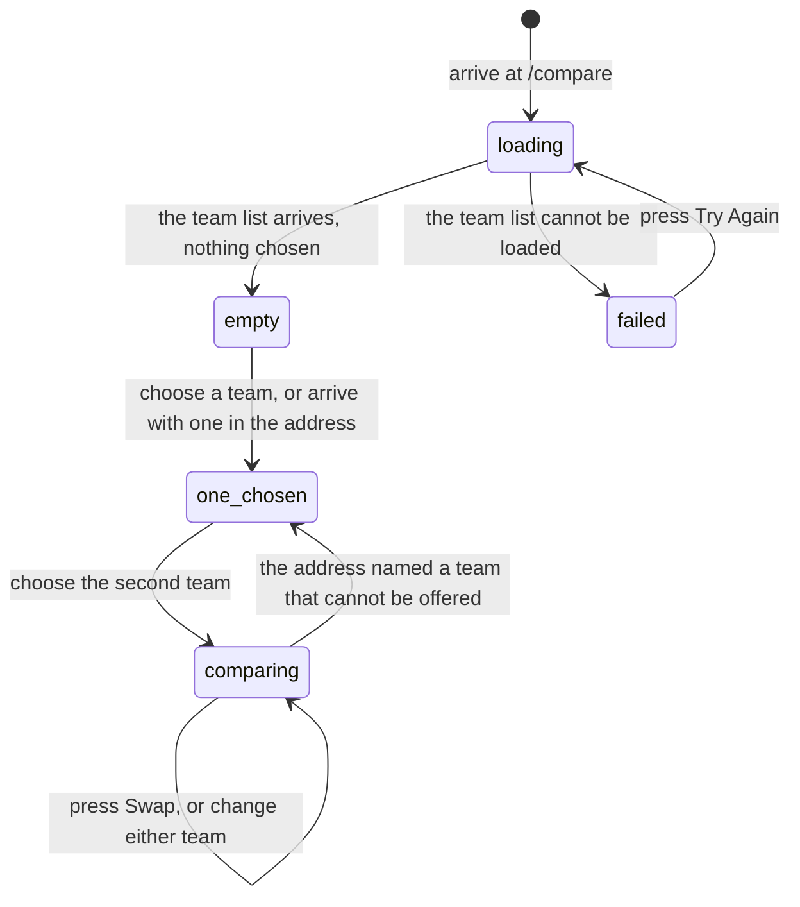

# Compare two teams

## Summary

`/compare` puts two teams side by side and works down a fixed list of numbers,
marking which team is ahead on each one. It ends with the record between the two
of them.

Everything on it is **career**, not this season. Win percentage, power score,
strength of schedule, playoff record, and the records against each division are
all across every season the two teams have played, and the head-to-head is
all-time. Only the heading over the first block says so.

It is the one page in the app whose selections are kept in the address, so a
comparison can be linked to and shared. It is also not in the navigation
anywhere: the only way in from inside the app is a small icon on a standings row,
which arrives with one team already chosen.

## The simple case

A user opens the standings, hovers a team's row, and presses the small scales
icon. `/compare?team1=…` opens with that team in the left dropdown and the right
one empty, under the words "Select the second team to start comparing".

They pick a second team. The page fills with four blocks: **Career Statistics**,
**Playoff Performance**, **vs Division Tiers**, and **Head-to-Head**. In each
row the leader's number is drawn in the accent colour and the other is plain. The
address becomes `/compare?team1=…&team2=…`, which can be copied and sent.

## The interaction, event by event

### Arrive

The whole page waits for the league's team list before drawing anything. Until
it arrives the screen is empty apart from a centred "Loading teams...". If the
list cannot be loaded the page is replaced by a card reading "We couldn't load
the teams. Please try again." with a **Try Again** button, and there is no way to
use the page at all.

Once the list is there the page draws its heading, two dropdowns, and a swap
button between them. The swap button is dead until at least one team is chosen.

Then the address is read. `team1` and `team2` are team ids. Each is matched
against the list and, if found, selected. The address is **left untouched until
that has happened**: the team list arrives after the page mounts, so writing the
still-empty selection back to the address would erase the very ids the page is
waiting to read. **The list has hidden teams removed**, so a link naming a hidden
team finds nothing, that side stays empty, and the address is then rewritten
without it. Nothing tells the user their link lost half of itself.

Nothing is focused. Neither dropdown has a default.

### Leave without changing anything

Nothing is recorded. The selection lives in the address and in the page only; no
preference is kept, and returning to `/compare` with no query gives two empty
dropdowns.

### Begin editing

Choosing a team in either dropdown is the whole of it. There is no form, no
draft, and no dirty state — the selection *is* the state, and it takes effect
immediately.

Each dropdown leaves out whatever the other one has chosen, so the same team
cannot be put on both sides.

### While editing

Every change rewrites the address at once, **replacing** the current history
entry rather than adding one. Changing teams six times therefore leaves one entry
in the browser's history, and Back leaves the page rather than stepping through
the comparisons.

While the two teams' numbers are being fetched the four blocks are replaced by a
centred "Loading comparison...". The dropdowns stay live throughout.

**Swap** exchanges the two sides. It is a display change: no number changes
value, only which column it is in, and the two "leads" sentences in the
head-to-head block reverse accordingly.

### Submit

Nothing is submitted. This page only reads.

## Modifiers

| Modifier | Set at arrival | Changed while editing |
| --- | --- | --- |
| The user's role | No effect. A visitor, a player, and an admin see the same page and the same numbers. | No effect. |
| The record's state | A hidden team cannot be chosen and cannot be loaded from a link. A team with no completed matches shows zeros throughout and "First Meeting" in the last block. | A team hidden elsewhere stays selectable until the list refetches. |
| The season's state | No effect on the numbers, which are career. The team list itself is not season-scoped either. | No effect. |
| Viewport | The two dropdowns stack with the swap button between them; on a wide screen they sit side by side. Every comparison row stays three columns at every width, so long values are tight on a phone. | Re-flows on rotation. |
| Keys the app honours | Tab reaches the first dropdown, the swap button, then the second dropdown. | Enter or Space opens a dropdown; arrow keys move through it; Escape closes it. |

## Cancel and interrupt

| Event | Before the first edit | While editing or submitting |
| --- | --- | --- |
| Escape, or a Cancel button | No effect. There is no Cancel on this page. | Closes an open dropdown. There is no way to clear a chosen team once it is chosen — the dropdowns have no "none". |
| In-app navigation away, or switching tab within the page | Nothing is lost. | Nothing is lost either: the selection is in the address, so the browser's own history holds it. |
| Browser back or forward | Leaves the page. | **Back leaves the page rather than undoing a selection**, because every change replaces the history entry instead of adding one. Coming forward again returns to the last comparison. |
| Reload, or the tab closed | Gives two empty dropdowns. | **The comparison survives**, because it is in the address. This is the only page in the app where a reload preserves what the user set up. |
| Network lost mid-request | The team list never arrives and the retry card appears. | The comparison stays on "Loading comparison..." with no error and no timeout. |
| The request fails or times out | The read is retried once, then the retry card. | The numbers for one side fail and that side draws zeros rather than saying anything. |
| The session expires | No effect. Everything here is public. | No effect. |
| The same record changed in another tab, or by another user | No realtime. A result entered elsewhere does not reach an open comparison. | Same, and more so than elsewhere: the head-to-head block is deliberately told **not** to refetch when the page is opened or when the tab regains focus, so it can be over ten minutes stale before it is fetched again. |
| Browser autofill or a password manager writes into the form | No effect. There are no text fields. | No effect. |
| The window loses focus | Nothing. | Returning refetches the team list and the career numbers if they are over five minutes old. The head-to-head block does not refetch. |

After an interrupt the address is the state. Anything the address holds comes
back; anything it does not, does not.

## Interactions with other systems

**Permissions and roles.** None.

**Season scoping.** None — deliberately. Every number is career. See
[`foundations/seasons.md`](../foundations/seasons.md) for what career means and
[`stats/power-score.md`](../stats/power-score.md) for why a career power score
and a season power score can disagree.

**Validation and error display.** No input to validate. A failed team list
replaces the page; a failed comparison shows zeros.

**Unsaved changes.** None exist.

**Optimistic updates and rollback.** None.

**Realtime.** None.

**Offline.** The page cannot be opened; the team list is the first thing it
needs.

**Toasts and notifications.** None. This page never raises a message.

**URL state.** Both teams are in the address as ids, and they are the only page
state anywhere in 717rec that is. Selections replace rather than push, so the
history does not fill up. Nothing is written to the address until the incoming
link has been read, so a shared link survives both the first load and a reload.

**On a phone.** The dropdowns stack. Each comparison row keeps three columns, so
a long record beside a percentile badge can be cramped. The page does not
reserve space at the bottom for the fixed bottom bar the way the pages built on
the shared layout do; see [Open questions](#open-questions-and-verification).

**Accessibility.** Both dropdowns are proper comboboxes and are reachable and
operable from the keyboard. Neither has a visible label — the placeholder "Select
Team 1" is the only text, and it is gone once a team is chosen — so each carries
a spoken name, "Team 1" and "Team 2", that survives a selection. The swap button
is icon-only and is named "Swap teams". Which side is ahead is shown by colour
alone, with nothing else marking it.

**Side effects the user can notice.** Only pageviews. Nothing is written.

## Edge cases

- **A link naming a hidden team silently loses it.** The address is rewritten
  without it and the page asks the user to choose that side again.
- **A link naming a team that no longer exists behaves the same way.**
- **A team cannot be un-chosen from the dropdowns.** They have no empty entry, so
  the way back to a blank page is to edit the address by hand: taking a team out
  of the address takes it off the page, and clearing the query empties both sides.
- **A link naming the same team on both sides keeps only the left one.** The page
  never compares a team with itself; the address is rewritten with the duplicate
  dropped.
- **The head-to-head block says "First Meeting" only when the teams really have
  never played.** A read that fails draws a separate "Head-to-Head Unavailable"
  card saying the record could not be loaded and that this does not mean the
  teams have never played. Until B-73 both reasons drew the same card, so a
  failed read told two teams with a long history that they had never met.
- **Playoff Record and the three division records are compared on win
  percentage.** 2-0 in the playoffs is marked ahead of 3-9. A team with no games
  in a division tier rates 0 on that row, so it never wins it, and two records
  that rate the same leave neither side marked. Until B-70 these four rows were
  compared on the wins alone, which marked 3-9 ahead of 2-0.
- **Strength of schedule is compared as higher-is-better**, so the team that has
  played the tougher opponents is marked as ahead on that row. Nothing says that
  is what is meant.
- **A team with no career match carries no percentile badge.** It has not been
  measured, so it is given no rank rather than the bottom one. Until B-62 it drew
  a red "0%" pill on all four career rows, which read as worst in the league. The
  team page has always behaved this way; Compare now matches it.
- **Every career row and both playoff rows carry a percentile badge.** Win %,
  Game Win %, Power Score, SOS, Sweep Rate, Playoff Record and Championships all
  show one. The three division records do not: no percentile is worked out for
  those. Before B-71 the sweep rate, the playoff record and the championship
  count carried none either, although two of the three were being worked out on
  every page load and shown nowhere.
- **A team with no playoff matches carries no playoff badge.** It is left out of
  the playoff ranking rather than counted as a zero, so it is given no rank
  rather than the bottom one.
- **The championship badge is a shared rank.** Ranking counts every team that has
  played, and most have never won anything, so they all tie on the same rank and
  are drawn in the bottom colour. "Tied last on championships" is true, but on a
  league where few teams have won, it colours most of the page.
- **A tie on any row leaves neither number highlighted.**
- **The teams' initials are the fallback picture**, the first two letters of the
  name in capitals, so two teams starting with the same two letters look alike
  when neither has a logo.
- **The page is not in the navigation.** Only the standings link to it, only from
  a control that appears on hover, and always with the left-hand team already
  chosen.

## Open questions and verification

- **The page does not reserve space for the phone's bottom bar.** It does not use
  the shared page layout that adds that padding. `/teams/:teamId` has the same
  shape; see [`team-details.md`](team-details.md). **May be worth treating as a
  bug rather than documenting.**
- **The head-to-head block is deliberately excluded from the app's normal
  freshness rules**, refetching neither on opening the page nor on returning to
  the tab. A recently played match can therefore be missing from it for a long
  time. Whether that is intended is a product question.
- Not confirmed by hand: whether the standings' compare control is discoverable.
  It only appears on hover on a desktop row.
- Not confirmed by hand: what the percentile badges show for a league with very
  few teams.
- Not confirmed by hand: whether "Swap teams" is announced usefully in context;
  the button carries that name and an icon, with no visible text.
- Assumption: comparing career rather than season numbers is deliberate. The
  first block is headed "Career Statistics" and nothing offers a season view.

Verified against `717rec` commit `ea5c8f4`.
