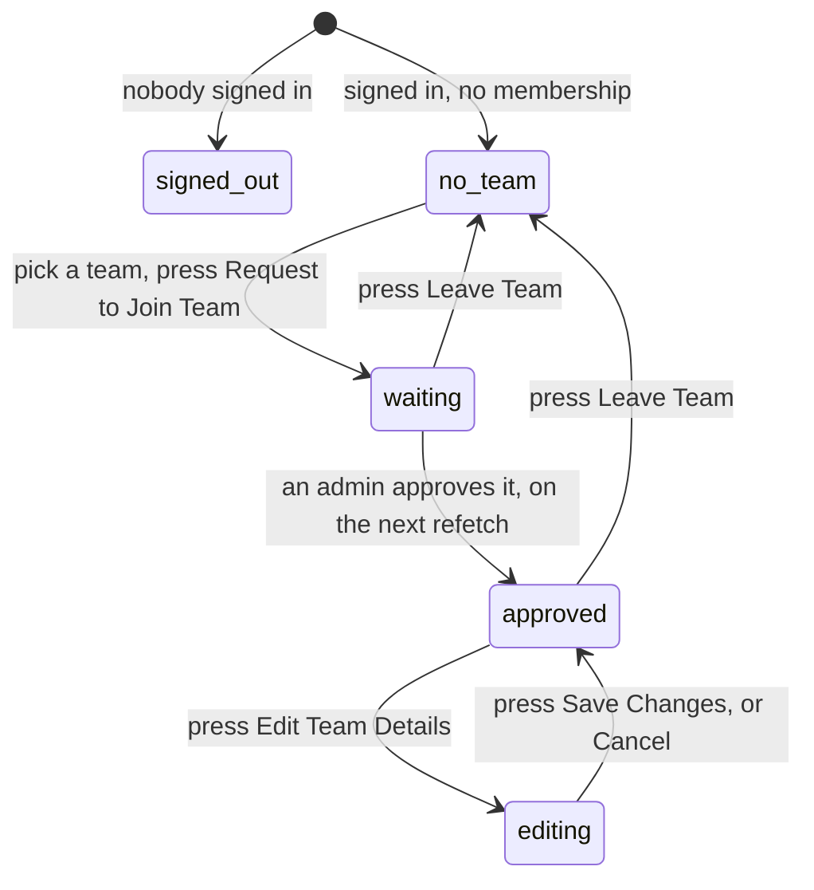

# My team

## Summary

`/my-team` is the page a player joins a team from, waits for approval on, leaves
from, and — once approved — renames their team from. It is the only place in the
app where an ordinary player can change anything about a team.

It is also the hardest page in the app to reach. There is one link to it
anywhere, it is labelled **Join a Team**, and it is only drawn for a user who is
*not* on a team. A player who already has a membership has no link to this page
at all: the same menu entry becomes **My Team** and points at the team's public
page instead. To get back here they must type the address or use a bookmark.

The route has **no guard**. A visitor who reaches it gets a page, not a redirect.

## The simple case

A signed-in player with no team opens `/my-team` from the user menu. The page
reads **My Team**, then "Manage your team membership and edit team details", then
a section headed **Team Membership** explaining that admin approval is required.

Below it, one dropdown listing every team by name with its logo, and a button
reading **Request to Join Team**. The player picks a team and presses it. A toast
says "Team Request Submitted — Your request to join the team has been submitted
for admin approval", and the dropdown is replaced by a yellow card showing the
team, a **Pending Approval** badge, and the date they asked.

Some time later an admin approves it. The next time the player opens the page the
card is green, says **Approved** with a date, and adds the line "You can edit
team details". A second card appears below it, **Team Management**, with the
team's logo and an **Edit Team Details** button.

## The interaction, event by event

### Arrive

**Signed out**, the page still renders. The heading, the description, and the
Team Membership section are all drawn, and where the team dropdown would be there
is an empty state:

> **No Teams Available** — There are no teams to join at the moment. Check back
> later or contact an admin.

That is not true, and there is no sign-in prompt anywhere on the page. See
[Open questions](#open-questions-and-verification).

**Signed in**, the membership is fetched and a spinner sits in the middle of the
section until it answers. Then one of three things is drawn:

| State | What the page shows |
| --- | --- |
| No membership | A dropdown of every team, a **Request to Join Team** button, and "Your request will be reviewed by an admin before approval" |
| Waiting for approval | A yellow card: team logo, team name, a **Pending Approval** badge, "Requested *date*", and a **Leave Team** button |
| Approved | A green card: the same, but an **Approved** badge, "Approved *date*", the line "You can edit team details", and below it the **Team Management** card |

Nothing is focused and the dropdown starts unset. The team list is every team the
league has, ordered by name — it is not filtered by season and it is **not
filtered for hidden teams**.

### Leave without changing anything

Nothing is recorded. A team chosen in the dropdown but not submitted is
forgotten. A part-typed team name in the edit form is forgotten.

### Begin editing

There are two separate edits on this page.

**Choosing a team** makes the **Request to Join Team** button live. Until a team
is chosen the button is dead. Nothing else changes and nothing is validated.

**Pressing Edit Team Details** in the Team Management card swaps the card for a
form and fills it from the team as it stands: **Team Name** and **Team Image
URL**. That is the moment the form becomes dirty. Nothing marks it as dirty and
there is no warning about leaving.

### While editing

In the join dropdown, nothing happens until the button is pressed.

In the edit form, typing a picture address shows a **Preview** underneath —
the picture as it will look, beside the name as typed. A bad address shows the
fallback the app uses everywhere for a missing logo, so there is no way to tell
a wrong address from a slow one.

The only rule enforced is that **Save Changes is dead while the name is blank**.
Nothing checks the length of the name, whether another team already has it, or
whether the picture address is an address at all.

The address bar never changes. `/my-team` is `/my-team` throughout.

### Submit

**Request to Join Team** sends one request and disables the button, which reads
"Submitting Request..." while it is in flight. On success a toast confirms it,
the dropdown clears, and the membership is re-read so the yellow waiting card
appears. On failure a red toast carries the reason through.

**Save Changes** sends the new name and picture and disables the button, which
reads "Saving...". On success a toast says "Team Updated — Team details have been
successfully updated", the form closes back to the card, and the team lists and
the team's own page are marked stale so they show the new name next time they are
looked at. On failure a red toast says "Update Failed" with the reason, and the
form stays open with everything typed.

**Leave Team** asks first. A dialog reads "Leave team? — Are you sure you want to
leave *team*? You will lose your association with this team and any editing
privileges." with **Cancel** and **Leave Team**. Confirming deletes the
membership outright — not a request, not a withdrawal, a deletion — and a toast
says "Left Team". The page returns to the join dropdown.

## Modifiers

| Modifier | Set at arrival | Changed while editing |
| --- | --- | --- |
| The user's role | A visitor gets the misleading empty state. A player gets one of the three states above. **An admin gets exactly the same page as a player** — being an admin gives no extra power here, and an admin with no membership is offered the same join dropdown. | Signing out in another tab collapses the page to the visitor state under the cursor. |
| The record's state | Whether a membership exists, and whether it is approved, decides the whole page. An unapproved membership grants nothing except the sight of the waiting card. | An approval granted elsewhere does not reach an open page. The user keeps seeing the yellow card until a refetch, up to five minutes. |
| The season's state | No effect. Memberships are not season-scoped, and neither is the team list offered. | No effect. |
| Viewport | The page is a single narrow column at every width. The membership card's team block and its Leave Team button sit on one row, which is tight on a small screen. | Re-flows on rotation. |
| Keys the app honours | Tab reaches the dropdown, then the button; or the Edit button, then the two fields, then Save and Cancel. | Enter opens the dropdown or presses the focused button. Escape closes the dropdown or the Leave Team dialog. |

## Cancel and interrupt

| Event | Before the first edit | While editing or submitting |
| --- | --- | --- |
| Escape, or a Cancel button | No effect. | Escape closes the team dropdown or the Leave Team dialog. **Cancel** in the edit form closes it and discards what was typed with no confirmation. Neither aborts a request already sent. |
| In-app navigation away, or switching tab within the page | Nothing is lost. | **Everything typed is lost, with no warning.** A save already sent still lands, and the team really is renamed — the user just never sees the toast. |
| Browser back or forward | Returns to the previous page. | Same as navigating away, and the app cannot prevent it. Coming forward again gives the card, not the form. |
| Reload, or the tab closed | The page rebuilds from the membership. | Anything typed is lost. A save already sent still lands. |
| Network lost mid-request | The membership does not load. For a signed-in user the section shows the spinner and then falls through to the visitor's "No Teams Available" state, because a failed read and no teams look the same. | The write fails and a red toast carries the reason. Nothing is queued. |
| The request fails or times out | The read is retried once, then as above. | The form keeps everything typed and reports the failure. The join button comes back to life. |
| The session expires | The page collapses to the visitor state on the next render. | The write fails and reports it. The page still looks signed in until something re-reads the session. |
| The same record changed in another tab, or by another user | No realtime. An admin approving, rejecting, or removing the membership does not reach an open page. | Same. Two tabs can each rename the team, and the last write wins with nothing to say it happened. |
| Browser autofill or a password manager writes into the form | The team dropdown cannot be autofilled. | The Team Name and Team Image URL fields are ordinary text inputs and could be filled by an aggressive form filler. Nothing would mark the form dirty differently, and nothing validates it. |
| The window loses focus | Nothing. | **Returning refetches the membership if it is over five minutes old.** An approval granted while the user was away can turn the yellow card green mid-edit, and the Team Management card can appear underneath an open form. |

After an interrupt whatever reached the database is what happened. Nothing is
restored and nothing is confirmed.

## Interactions with other systems

**Permissions and roles.** An approved membership is what unlocks the Team
Management card. The rule is mirrored in the browser and enforced in the
database independently; see
[`foundations/accounts-and-roles.md`](../foundations/accounts-and-roles.md).

**Season scoping.** None. Memberships and the team list are not scoped to a
season.

**Validation and error display.** One rule, in the browser: a team name may not
be blank. Everything else is left to the database, and its refusals arrive as
toasts with the reason passed through.

**Unsaved changes.** Not handled. No guard, no prompt, no draft.

**Optimistic updates and rollback.** None. Both writes disable their button and
wait.

**Realtime.** None. This matters more here than on most pages, because the thing
the user is waiting for — approval — is done by somebody else and never arrives
on its own.

**Offline.** Reads fail and the page falls back to the visitor state. Writes
fail and are lost.

**Toasts and notifications.** Every action on this page produces exactly one
toast. Approval itself produces none: nobody tells the player they were
approved. See
[`foundations/messages-to-the-user.md`](../foundations/messages-to-the-user.md).

**URL state.** None. `/my-team` carries nothing.

**On a phone.** One narrow column throughout. The membership card puts the team
block and the Leave Team button on the same row at every width, so a long team
name is squeezed.

**Accessibility.** Both fields in the edit form have real labels. The three
membership states replace one another with no announcement, so a screen reader
user is not told that a request was accepted or that the page changed shape. The
Leave Team dialog traps focus correctly.

**Side effects the user can notice.** Requesting to join puts an entry in the
admin's request list; see
[`admin/handle-requests.md`](../admin/handle-requests.md). Renaming the team
changes its name everywhere in the app, including its address — see
[`team-details.md`](team-details.md) for what that breaks.

## Edge cases

- **A signed-out visitor is told there are no teams.** The page does not ask them
  to sign in and does not say that the list is empty because nobody is signed in.
- **The join dropdown offers hidden teams.** Every other list in the app removes
  them; this one does not, so a player can request to join a team that is no
  longer playing.
- **The join dropdown is not filtered by season either.** Every team the league
  has ever had is offered.
- **There is no way to switch teams.** The dropdown is only drawn when there is
  no membership, so a player who wants to move must press Leave Team first,
  losing the membership outright, and then ask to join the new one. The app has a
  "change teams" path that says "Your request to change teams has been submitted"
  and nothing can reach it.
- **Leaving is instant and unconditional.** It deletes the membership; it does
  not ask an admin. Rejoining means asking again and waiting again.
- **Renaming the team is instant and unconditional too.** The card says as much:
  "Changes will be applied immediately."
- **The team's id is printed on the page** under its name, in the Team Management
  card.
- **A blank picture address clears the team's picture.** Emptying the field and
  saving removes the logo everywhere.
- **Nothing warns that the name is already taken.** Two teams may end up with the
  same name, which makes both unreachable by their address; see
  [`team-details.md`](team-details.md).
- **The Cancel button empties the form rather than restoring it**, which is
  invisible because the form is closed at the same moment, and the form is
  refilled from the team the next time it is opened.

## Open questions and verification

- **`/my-team` is unreachable from the app once a player is on a team.** The only
  link to it is drawn for users with no membership, and every other entry point
  goes to the team's public page, which has no edit control. Leaving a team and
  renaming a team are therefore both hidden from the people who have the right to
  do them. **May be worth treating as a bug rather than documenting.**
- **A signed-out visitor is shown a wrong statement rather than a sign-in
  prompt.** The route has no guard and the page has no signed-out state of its
  own, so it falls through to "No Teams Available". **May be worth treating as a
  bug rather than documenting.**
- **A failed membership read looks the same as being signed out.** Both end in
  the same empty state with no error and no toast. **May be worth treating as a
  bug rather than documenting.**
- **A user can no longer have more than one membership row.** The old read did
  fail rather than choose, and the page did fall through to "No Teams Available",
  which is why the only control it offered inserted yet another row. The read now
  takes one row — approved first, then oldest — and the database refuses a second.
  Fixed under B-07 in
  [`bug-triage.md`](../bug-triage.md#b-07-a-second-membership-row-permanently-breaks-every-member-ability).
- Not confirmed by hand: whether the database allows an ordinary approved member
  to rename any team or only their own. The browser only ever offers their own.
- Not confirmed by hand: whether renaming a team while a match is in progress
  affects anything showing that team's name.
- The page's own test replaces the entire page with a stub, so every state above
  is read from the components rather than from a passing test.
- Assumption: "Admin approval is required" applies to every join, including the
  first player on a brand-new team. Nothing in the code makes an exception.

Verified against `717rec` commit `ea5c8f4`.
