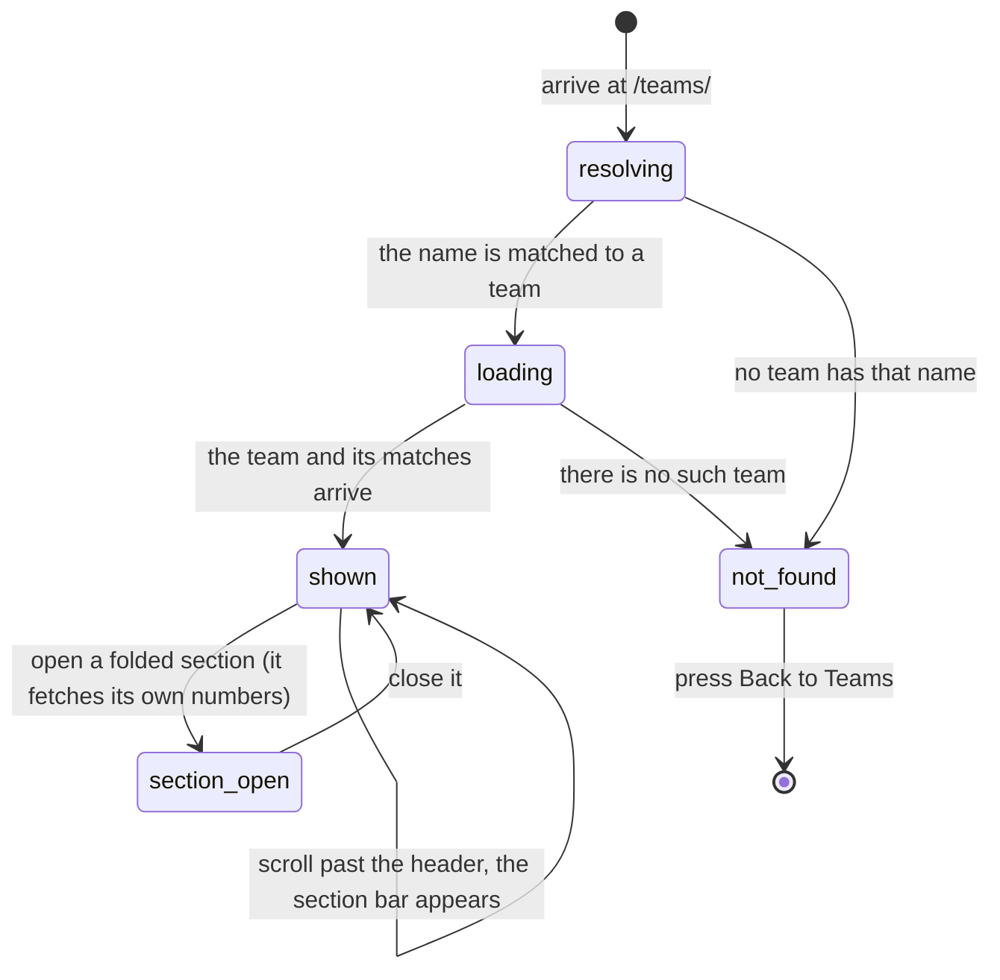

# A team's page

## Summary

`/teams/:teamId` is everything the app knows about one team, on one long page:
who is on it, how it has done this season, who it plays well and badly against,
every match it has played, and what it has won across every season it has
existed.

Almost all of it is folded away. The page opens with the team's identity, two
summary cards, and the roster; the other five sections are closed, and each one
fetches its own numbers only when it is opened. A user who never opens anything
sees a short page and the app never asks the league for most of the data.

The address in the URL is normally the **team's name**, not its id. That has
consequences a user can notice, and they are set out below.

## The simple case

A user taps a team anywhere in the app. The page shows a skeleton for a moment,
then the team's logo, its name in large letters, its division as a badge, a line
reading "Last match: W 2-1 vs Off Dogs", and a row of small round **badges** for
what the team has won.

Under that, two cards side by side: **Power Score**, with a gauge and the team's
record; and **Ranking**, showing the team's place out of the whole field with an
arrow for which way it has moved.

Then **ROSTER**, already open, listing every player as a chip. Then five closed
sections: Stats & Report Card, Matchups & Rivalries, Match History, Career &
Achievements, and — only when the league has been scoring matches live — Player
Stats.

Once the user scrolls past the header, a bar drops in at the top of the window
with five buttons: Overview, Stats, Matchups, Matches, Career. Tapping one
scrolls to that section.

## The interaction, event by event

### Arrive

The address holds either the team's id or its name reduced to lower case with
the punctuation removed — `Baggin' & Braggin'` becomes `baggin-braggin`. **Every
link inside the app uses the name form.** An id only appears if it was typed or
came from an old bookmark.

A name has to be matched to a team first, which means fetching the whole team
list, **hidden teams included**. So a hidden team's page opens normally from a
direct link even though the team is absent from every list.

The whole page waits: until the team, its matches, and the name match have all
resolved, there is nothing but a stack of grey blocks. There is no partial page.

What is shown once it resolves, in order:

| Section | State | What it holds |
| --- | --- | --- |
| Header | always drawn | logo, name, division badge, last match line, badges |
| Overview | always drawn | Power Score with the season record; Ranking out of the field, with the change since last week |
| Roster | **open** | one chip per player, or "No players registered" |
| Player Stats | **absent** unless live scoring has recorded rounds for this team | per-player points and bags per round |
| Stats & Report Card | closed | the season's full breakdown, advanced stats by season, and a report card |
| Matchups & Rivalries | closed | closest rival, best matchup, worst matchup, and the record against every opponent |
| Match History | closed | every completed match this season |
| Career & Achievements | closed | career totals, a power score chart across seasons, and every badge |

The closed sections' contents are **not loaded until they are opened**, so the
first opening of Stats, Matchups, or Career costs a wait, and closing and
reopening within five minutes is instant.

The closed section headers show a summary where they have one: Stats & Report
Card carries the team's record beside its chevron.

Nothing is focused on arrival. Scroll position is not reset, so arriving from
the bottom of a long page can land here part way down.

### Leave without changing anything

Nothing is recorded. Which sections were opened is not remembered — not in the
browser, not in the address, not anywhere. Coming back gives the default
arrangement again.

### Begin editing

There is nothing to edit. A player who is approved on this team edits its name
and picture somewhere else entirely, on [`my-team.md`](my-team.md). Nothing on
this page says so and there is no link to it.

### While editing

Not applicable. Opening and closing sections is the whole of the interaction,
and each is immediate and local.

The section bar at the top appears once the page is scrolled past about 200
pixels and disappears when it is scrolled back. It highlights whichever section
is currently under the top of the window. Pressing one of its buttons scrolls
smoothly to that section — but the section is still **closed**, so the user
arrives at a folded heading and has to open it.

### Submit

Nothing is submitted. Every write that touches this team happens elsewhere.

## Modifiers

| Modifier | Set at arrival | Changed while editing |
| --- | --- | --- |
| The user's role | No effect at all. A visitor, a player, and an admin see the same page with the same sections and the same numbers. There is no edit control here for anyone. | No effect. |
| The record's state | A hidden team's page renders normally. A team with no players shows "No players registered". A team with no completed matches loses the last-match line and shows "No Match History". A team with no badges shows nothing in the header and "No achievements yet" in the Career section. | Numbers change under the user on a refetch. Sections already open update; sections still closed will simply be current when opened. |
| The season's state | The header, the Overview cards, the roster, and the Match History are all the **active season**. Career, badges, and the advanced stats look across every season. Nothing on the page marks which is which. | A season changeover empties the record and the match history at the next refetch, while the career numbers stay. |
| Viewport | On a phone the logo is smaller, the breadcrumbs are replaced by a single Back button, and the section bar scrolls sideways. Badges are bigger and open a dialog on tap; on a wide screen they show a tooltip on hover. | Re-flows on rotation. |
| Keys the app honours | No shortcuts. Tab reaches Back, then each section header in turn, then whatever is inside an open one. | Enter or Space opens the focused section. Escape closes a badge dialog. |

## Cancel and interrupt

| Event | Before the first edit | While editing or submitting |
| --- | --- | --- |
| Escape, or a Cancel button | No effect. There is no Cancel on this page. | Closes an open badge dialog. Nothing else. |
| In-app navigation away, or switching tab within the page | Which sections were open is lost. Nothing else is held. | No effect; nothing is ever in flight from this page but reads. |
| Browser back or forward | Leaves the page. Coming back gives a fresh page with the default sections and no memory of what was opened. **Back from here to `/teams` restores that list's scroll position**; the breadcrumb link to Teams does not, because it is a new navigation rather than a history move. | Same. |
| Reload, or the tab closed | The page rebuilds from the database with every section closed again. | Same. |
| Network lost mid-request | The page stays a skeleton indefinitely, or shows **Team Not Found** if the read fails outright. There is no message that the network is the problem. | An open section that has not loaded shows its own retry card; the Advanced Stats block offers "We couldn't load advanced stats. Please try again." |
| The request fails or times out | Reads are retried once. A failed team read gives **Team Not Found** — which is the same screen as a team that genuinely does not exist. | As above, per section. |
| The session expires | No effect. Every part of this page is public. | No effect. |
| The same record changed in another tab, or by another user | No realtime. A score entered elsewhere does not reach an open team page. | Same. Match history is treated as never fresh, so it does update on the next mount or tab return, while the team's record and power score wait for the five-minute window. |
| Browser autofill or a password manager writes into the form | No effect. There are no fields. | No effect. |
| The window loses focus | Nothing. | **Returning refetches the match history immediately and everything else if it is over five minutes old.** Numbers in an open section can change under the user. |

After an interrupt the page is rebuilt from scratch with every section closed.
Nothing about the arrangement survives leaving.

## Interactions with other systems

**Permissions and roles.** None. This is the largest page in the app with no
role behaviour of any kind. See
[`cross-cutting/permissions.md`](../cross-cutting/permissions.md).

**Season scoping.** Mixed, and unmarked. The top of the page and the match
history are the active season; the career section and the badges are not. See
[`foundations/seasons.md`](../foundations/seasons.md).

**Validation and error display.** No input. Section-level failures appear as
in-place retry cards rather than toasts.

**Unsaved changes.** None exist.

**Optimistic updates and rollback.** None.

**Realtime.** None.

**Offline.** A page already loaded stays. A section not yet opened will fail to
load when opened, with a retry card.

**Toasts and notifications.** None. This page never raises a message.

**URL state.** The team is in the address and nothing else. Which sections are
open, and where the page is scrolled, are not, so a link to this page is always a
link to the top of it with everything folded.

**On a phone.** A single Back button replaces the breadcrumbs. The section bar
scrolls sideways rather than wrapping. Badges are tapped for a dialog rather than
hovered for a tooltip. The page does not reserve space at the bottom for the
fixed bottom bar the way the pages built on the shared layout do; see
[Open questions](#open-questions-and-verification).

**Accessibility.** Each section is a landmark with a heading tied to it, and the
section bar is marked as navigation with the current section flagged. The bar
appearing and disappearing on scroll is not announced. Icons are hidden from
screen readers.

**Side effects the user can notice.** Only pageviews. Opening a section fetches
data and writes nothing.

## Edge cases

- **Team Not Found means three different things.** A name that matches nothing,
  an id that matches nothing, and a read that failed all give the same screen:
  "Team Not Found — The team you're looking for doesn't exist." with a **Back to
  Teams** button.
- **Renaming a team changes its address.** Every existing link and bookmark to
  the old name lands on Team Not Found, silently. Nothing redirects.
- **Two teams whose names reduce to the same address collide.** The first match
  by name order wins and the other team is unreachable by name. Its id still
  works.
- **A tie in the last match is shown as a loss.** The last-match line reads W
  only when the team is recorded as the winner, so a match completed with no
  winner reads L with the two scores beside it.
- **The last-match line links to the opponent by name.** If the opponent is
  missing it reads "Unknown" and links to a page that does not exist.
- **The section bar starts by highlighting Stats**, not Overview, until the first
  scroll corrects it.
- **The section bar's buttons scroll to closed sections.** Four of the five land
  the user on a folded heading.
- **Back behaves differently depending on where the user came from.** From the
  standings the page returns to the standings and scrolls to where the user was,
  as a new navigation. From anywhere else it is a plain history step back.
- **Badges are not filtered by season.** Every badge the team has ever earned is
  in the header row and the Career section, so a badge from three seasons ago
  sits beside one from last week with only its tooltip to tell them apart.
- **The header shows at most eight badges** and the Career section at most
  twelve, each with a "+N" marker for the rest. There is no way to see the rest.
- **Player Stats disappears rather than being empty.** A team with no
  live-scored rounds has no such section, and nothing says the feature exists.

## Open questions and verification

- **The page does not reserve space for the phone's bottom bar.** It does not use
  the shared page layout that adds that padding, so the last of its content can
  sit behind the fixed bar on a small screen. `/compare` has the same shape; see
  [`compare-teams.md`](compare-teams.md). **May be worth treating as a bug rather
  than documenting.**
- **A failed read is indistinguishable from a missing team.** Telling a user a
  team does not exist when the network dropped is misleading, and the read does
  throw a distinguishable error. **May be worth treating as a bug rather than
  documenting.**
- Not confirmed by hand: whether renaming a team really does break its old links
  in production, or whether something outside the app redirects.
- Not confirmed by hand: what the section bar does on a very narrow screen, where
  five buttons cannot fit and the bar scrolls sideways.
- Not confirmed by hand: how long the whole-page skeleton lasts in practice,
  given it waits for three reads to finish.
- Not confirmed by hand: what the Advanced Stats and Report Card blocks show for
  a team with exactly one season played.
- The page's own test replaces every section with a stub, so the contents listed
  above are read from the components rather than from a passing test.
- Assumption: sections are closed by default to keep the first view short and to
  avoid fetching data nobody asked for. The code says the second part; the first
  is inferred.

Verified against `717rec` commit `ea5c8f4`.
